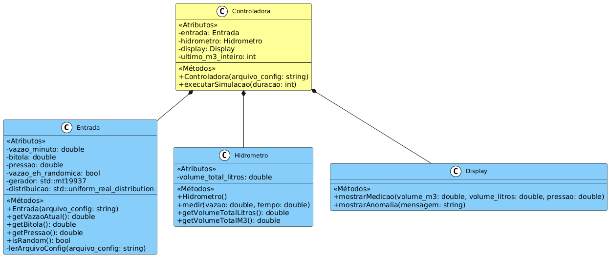
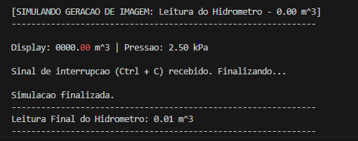
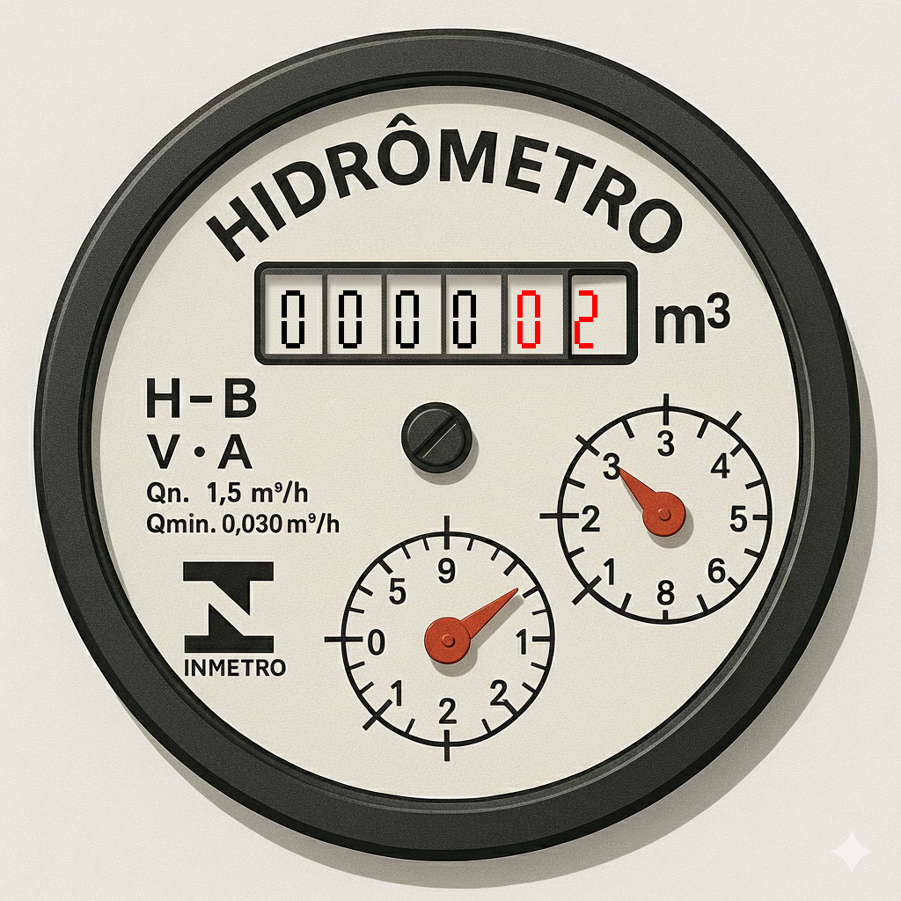

<h1 align="center"> Simulador de Hidrômetro </h1>

 

<h4 align="center"> Criação de um simulador de hidrômetro em C++ com Abordagem Orientada a Objetos para a disciplina de Padrões de Projetos. </h4>
<h4 align="center"> Engenharia de Computação/<a href="https://www.ifpb.edu.br/">IFPB</a>(Setembro 2025) </h4>

 
 

 

<h4> | <a href="#contexto">Contexto e objetivo</a> | <a href="#requisitos">Análise de requisitos</a> | <a href="#uml">Diagrama de classes (UML)</a> | <a href="#arquivos">Descrição dos arquivos</a> | <a href="#ferramentas">Ferramentas</a> | <a href="#implementacao">Implementação</a> | <a href="#testes">Testes e output </a> | <a href="#creditos">Créditos</a> |</h4>

<h2 id="contexto"> :brain: CONTEXTO E OBJETIVO</h2>

Este projeto tem como objetivo principal simular o funcionamento de um hidrômetro residencial utilizando a linguagem C++ e os princípios da Programação Orientada a Objetos (POO). O programa simula a medição do volume de água em tempo real, a leitura de parâmetros de configuração e a detecção de anomalias, como a passagem de ar no cano. A arquitetura modular e o design de classes facilitam a escalabilidade e a manutenção do sistema. O desenvolvimento do projeto dar-se-á uma proposta de atividade para a cadeira de Padrões de Projetos, ministrada pelo professor doutor Katyusco Santos.

<h2 id="requisitos"> :clipboard: ANÁLISE DE REQUISITOS</h2>

<h4>➔ Requisitos de Funcionalidade</h4>
<ul>
  » Entrada de Dados (Vazão e Pressão):
  <li> O sistema deve permitir a entrada da vazão de água na faixa de 0 a 100 milímetros por minuto; </li>
  <li> A vazão pode ser configurada para ser um valor fixo ou um valor aleatório a cada ciclo de simulação; </li>
  <li> A pressão também é um parâmetro de entrada, lido junto com a vazão. </li>
</ul>

<ul>
  » Medição e Exibição:
  <li> O sistema deve calcular o volume de água cumulativo ao longo do tempo; </li>
  <li> O volume deve ser exibido em um formato que simule um hidrômetro real, com 4 dígitos para metros cúbicos (m³) e 2 dígitos vermelhos para as centenas e dezenas de litros; </li>
  <li> A medição do hidrômetro deve ser contínua e ininterrupta, independentemente dos valores de pressão ou vazão. </li>
</ul>

<ul>
  » Geração de Imagem (finalizada na versão 2.0):
  <li> Uma imagem representativa do hidrômetro deve ser gerada em intervalos configuráveis; </li>
  <li> Um evento de "geração de imagem" deve ser acionado a cada vez que o valor dos metros cúbicos for alterado, registrando o valor para relatórios ou fins de apresentação; </li>
  <ul>
    <li>Na primeira etapa do projeto (versão 1.0), o resultado foi exibido apenas no terminal, através da classe Display. </li>
  </ul> 
</ul>

<ul>
  » Detecção e Tratamento de Anomalias:
  <li> O sistema deve ser capaz de detectar anomalias no fluxo de água; </li>
  <li> Em caso de ausência de água (vazão igual a 0), o sistema deve avisar que há passagem de ar pelo cano, registrando um volume simulado de 10% da vazão máxima; </li>
  <li> A medição de água no fluxo contrário deve ser desconsiderada pelo sistema. </li>
</ul>

<ul>
  » Configuração do Sistema:
  <li> O software deve ler todos os parâmetros de configuração (vazão, pressão, etc.) a partir de um arquivo de texto externo (.txt). </li>
</ul>

<h4>➔ Requisitos Não Funcionais</h4>
<ul>
  <li> Portabilidade: O software deve ser compilável e executável; </li>
  <li> Performance: A simulação deve ser executada em tempo real, com cada iteração do loop principal correspondendo a um segundo de tempo de simulação; </li>
  <li> Usabilidade: A interface do usuário deve ser simples e baseada em texto, com a saída sendo exibida de forma clara no console. </li>
</ul>

<h2 id="uml"> &#127959 Diagrama de Classes (UML)</h2>

A arquitetura do projeto foi modelada usando um diagrama de classes da Linguagem de Modelagem Unificada (UML). Esta representação visual ilustra a estrutura do sistema, mostrando como as classes se relacionam e interagem para simular o hidrômetro.

O diagrama destaca o relacionamento de Composição, onde a classe Controladora atua como a orquestradora central, possuindo e gerenciando instâncias das classes Entrada, Hidrometro e Display para executar a simulação de ponta a ponta. 

<ul>
  <li> <b>Entrada:</b> Responsável por ler os parâmetros de configuração de um arquivo de texto (parametros.txt). Ela gerencia a vazão e a pressão, podendo fornecer valores fixos ou aleatórios; </li>
  <li> <b>Hidrômetro:</b> A classe principal de medição. Ela mantém o registro do volume de água total e calcula o volume adicionado a cada intervalo de tempo; </li>
  <li> <b>Display:</b> Responsável pela parte visual. Ela formata e exibe os dados de medição no console, simulando o mostrador de um hidrômetro real, com cores e formatação específicas; </li>
  <li> <b>Controladora:</b> O "maestro" do sistema. É a Controladora que cria e gerencia as instâncias de Entrada, Hidrometro e Display. Ela executa o loop principal da simulação, obtendo dados e atualizando o estado do hidrômetro a cada segundo. </li>
</ul>

 

<h2 id="arquivos"> 🗂️ DESCRIÇÃO DOS ARQUIVOS DO PROJETO</h2>

<h4>➔ Arquitetura de diretórios:</h4>
<ul>
    <li><a href="https://github.com/ligianogueira2/projeto_hidrometro_pp/tree/main/src"><b>src/</b>:</a> Contém os arquivos de implementação (.cpp) de todas as classes do projeto e a função principal (main), que inicializa a Controladora e inicia a simulação. </li>
    <li><a href="https://github.com/ligianogueira2/projeto_hidrometro_pp/tree/main/include"><b>include/</b>:</a> Armazena os arquivos de cabeçalho (.h) de todas as classes, que definem a interface (métodos e atributos) do nosso modelo de hidrômetro. </li>
    <li><a href="https://github.com/ligianogueira2/projeto_hidrometro_pp/blob/main/.gitignore"><b>config/</b>:</a> Contém o arquivo parametros.txt, usado para configurar a simulação (vazão e pressão). </li>
    <li><a href="https://github.com/ligianogueira2/projeto_hidrometro_pp/blob/main/README.md"><b>README.md</b>:</a> Este arquivo, que fornece uma visão geral do projeto, sua arquitetura, as ferramentas utilizadas e as instruções para a compilação. </li>
    <li><a href="https://github.com/ligianogueira2/projeto_hidrometro_pp/blob/main/.gitignore"><b>.gitignore</b>:</a> Arquivo de configuração do Git que define quais arquivos e pastas devem ser ignorados (por exemplo, arquivos executáveis e de compilação). </li>
</ul>

<h4>➔ Bibliotecas utilizadas:</h4> 
<ul>
  <li>iostream e cstdio: Essas bibliotecas foram usadas para a manipulação de entrada e saída de dados. Enquanto iostream é utilizada para a exibição de mensagens no console, cstdio é essencial para o uso de funções de formatação de strings, como sprintf; </li>
  <li>windows.h: Uma biblioteca específica do sistema operacional Windows, necessária para utilizar funções como Sleep(), que permite pausar a simulação por um tempo determinado; </li>
  <li>chrono: Essencial para lidar com tempo, garantindo a medição precisa dos intervalos da simulação; </li>
  <li>iomanip: Usada para formatar a saída no console, permitindo um controle preciso, como a definição de casas decimais para exibir os valores do hidrômetro; </li>
  <li>csignal: Uma biblioteca padrão do C++ que permite o tratamento de sinais do sistema, como o comando Ctrl + C para finalizar a execução da simulação de forma controlada; </li>
  <li>atomic: Utilizada para criar variáveis que podem ser acessadas de forma segura por diferentes partes do programa, como o sinalizador g_executar_simulacao, garantindo que o programa seja encerrado corretamente; </li>
  <li>vector: Fornece a funcionalidade de arrays dinâmicos, usada para armazenar a configuração dos segmentos de cada dígito do display; </li>
  <li>vcstring: Usada para funções que manipulam C-strings, como strlen, para obter o tamanho da string de texto do display; </li>
  <li>stb_image.h e stb_image_write.h: Essas bibliotecas de terceiros, conhecidas por sua simplicidade, foram integradas ao projeto para o carregamento da imagem base do hidrômetro e para a criação e salvamento das novas imagens com as leituras atualizadas. </li>
</ul>

<h2 id="ferramentas"> &#128295 PRINCIPAIS FERRAMENTAS UTILIZADAS </h2>

<ul>
    <li>Linguagem de Programação: C++  </li>
    <li>Editor de Código: Visual Studio Code (VS Code) </li>
    <li>Controle de Versão: Git </li>
    <li>Hospedagem de Código: GitHub </li>
    <li>Diagramação: PlantUML (para a geração do diagrama de classes) </li>
</ul> 

<h2 id="implementacao"> &#128187 IMPLEMENTAÇÃO </h2>

A implementação do projeto seguiu a arquitetura orientada a objetos. Cada classe foi desenvolvida para encapsular uma responsabilidade específica, garantindo que o código fosse modular, reutilizável e de fácil manutenção.
 

<ul>
  <li>A classe <a href="https://github.com/ligianogueira2/projeto_hidrometro_pp/blob/main/src/Entrada.cpp"><b>Entrada/</b></a> foi implementada para ler os dados do arquivo, gerenciando a vazão fixa ou aleatória. </li>
  <ul>
    <li>Valor Fixo e Normal (ex: 50): O programa lê um número positivo do arquivo e usa esse valor constante para a vazão durante toda a simulação; </li>
    <li>Valor Aleatório (ex: -1): Quando o programa lê -1 no arquivo para o parâmetro de vazão, ele entende que deve gerar um valor aleatório dentro de uma faixa predefinida (por exemplo, entre 0 e 100); </li>
    <li>Valor zero (ex: 0): O programa lê 0 e isso simula um cenário de "falta de água", ativando a anomalia de "passagem de ar no cano". </li>
  </ul> 

  
 __________________________________________________ 

  <li>O <a href="https://github.com/ligianogueira2/projeto_hidrometro_pp/blob/main/src/Hidrometro.cpp"><b>Hidrômetro/</b></a> foi codificado com a lógica de acúmulo de volume, isolando os cálculos de medição. Ele armazena internamente o volume total de água em litros e em metros cúbicos (m³). Sua principal responsabilidade é o método medir, que recebe a vazão e o tempo decorrido para atualizar o volume total. A fórmula de cálculo é a seguinte:

  
 Volume_m3 = (Vazao_L_min * Tempo_s) / (60 * 1000) 

  
 Onde: 

<ul>
    <li>Vazão_L_min: O fluxo de água em litros por minuto (L/min) fornecido pela classe Entrada; </li>
    <li>Tempo_s: O tempo decorrido em segundos (s) desde a última medição. A Controladora chama o medir a cada segundo; </li>
    <li>60: Constante para converter minutos em segundos; </li>
    <li>1000: Constante para converter litros em metros cúbicos. </li>
  </ul> 

  
 __________________________________________________ 

  <li>A Classe <a href="https://github.com/ligianogueira2/projeto_hidrometro_pp/blob/main/src/Display.cpp"><b>Display/</b></a> lida com a parte visual do projeto. Ela carrega uma imagem de fundo (hidrometro.png) e desenha os dígitos da leitura de forma programática. </li>

<ul>
  
 Funções Principais: 

  </ul> 

<ul>
    <li>mostrarMedicao(double volume_m3, double volume_litros, double pressao_kpa): Esta é a função central. Ela recebe o volume total em metros cúbicos (volume_m3) e converte o valor para uma representação em string. A lógica principal aqui é a separação da parte inteira e da parte decimal do volume para garantir que os dígitos decimais sejam exibidos corretamente, mesmo com valores pequenos. A função então usa desenhar_digito para renderizar o número na imagem do hidrômetro; </li>
    <li>desenhar_digito(unsigned char* dados, ...): Esta função desenha um único dígito de 7 segmentos na imagem. Ela recebe o caractere do dígito ('0' a '9') e as coordenadas, e determina quais segmentos do display devem ser ativados (true); </li>
    <li>desenhar_retangulo(unsigned char* dados, ...): Uma função utilitária para desenhar os retângulos que formam os segmentos dos dígitos. </li>
  </ul> 

<ul>
  
 Lógica de Visualização: 

  </ul> 

<ul>
    <li>Calcula a parte inteira (int inteiros = static_cast<int>(volume_m3);); </li>
    <li>Calcula a parte decimal, multiplicando a diferença por 100 (int decimais = static_cast<int>((volume_m3 - inteiros) * 100);); </li>
    <li>Formata ambas as partes em strings com preenchimento de zeros (%06d para os inteiros e %02d para os decimais); </li>
    <li>Concatena as duas strings para formar o número completo, permitindo que os dígitos da parte decimal sejam exibidos em vermelho separadamente. </li>
  </ul> 
  
  
 __________________________________________________ 

  <li>A Classe <a href="https://github.com/ligianogueira2/projeto_hidrometro_pp/blob/main/src/Controladora.cpp"><b>Controladora/</b></a> é o "cérebro" da simulação. Ela cria uma instância do hidrômetro e do display, e executa um loop contínuo para simular o fluxo de água ao longo do tempo. </li>

<ul>
  
 Função Principal: 

  </ul> 

<ul>
    <li>executarSimulacao(): Esta é a função de entrada do programa. Ela inicia um loop infinito que, a cada segundo, atualiza a medição do hidrômetro. A simulação só é interrompida quando o usuário pressiona Ctrl + C, graças ao signal_handler. A cada vez que a parte inteira do volume em m³ muda, a função mostrarMedicao do display é chamada para gerar uma nova imagem. </li>
  </ul> 

<h2 id="testes"> &#129514 TESTES E OUTPUT </h2>

<h4>➔ Testes </h4>

A fase de testes foi fundamental para garantir a funcionalidade do software. O processo incluiu: 
 

<ul>
    <li><b>Testes de Compilação:</b> Realizados continuamente para identificar e corrigir erros de sintaxe e dependências; </li>
    <li><b>Testes Funcionais:</b> Executados para validar as funcionalidades-chave, como a leitura correta dos parâmetros, o cálculo preciso do volume de água e a detecção da anomalia de "falta de água" quando a vazão era zero; </li>
    <li><b>Testes de Integração:</b> A interação entre a Controladora e as outras classes foi testada para assegurar que o fluxo da simulação ocorresse como o esperado. Por exemplo, verificou-se se a Controladora estava passando a vazão correta para o Hidrometro e se o Hidrometro, por sua vez, estava enviando o volume atualizado para o Display em cada ciclo.</li>
</ul> 

<h4>➔ Output (saída do programa) </h4>

<ul>
    <li>Versão 1.0: </li>
  </ul> 

A captura abaixo representa o output inicial do projeto, onde o display era exibido apenas no terminal. 
 

 

<ul>
    <li>Versão 2.0: </li>
  </ul> 

Abaixo, está a imagem gerada após a execução do código, simulando o display de um hidrômetro real.  
 

<h2 id="creditos"> &#11088 CRÉDITOS</h2>

<li>Estudante/desenvolvedora:</li>

<a href="http://lattes.cnpq.br/2405746986360435">Anna Lígia Alves Nogueira</a>

<li>Professor responsável:</li>

<a href="http://lattes.cnpq.br/1246085373474860">Katyusco de Farias Santos</a>
