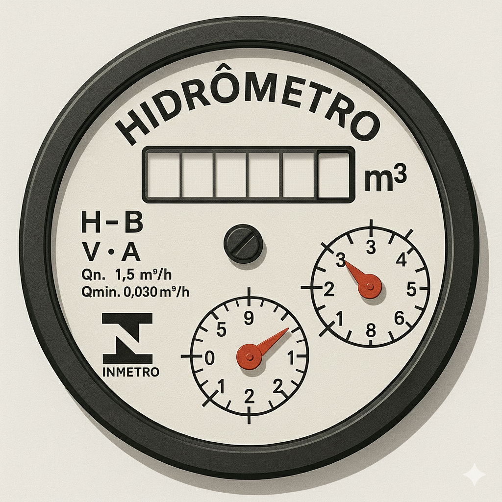

<h1 align="center"> Simulador de Hidrômetro </h1>

 

<h4 align="center"> Criação de um simulador de hidrômetro em C++ com Abordagem Orientada a Objetos para a disciplina de Padrões de Projetos. </h4>
<h4 align="center"> Engenharia de Computação/<a href="https://www.ifpb.edu.br/">IFPB</a>(Setembro 2025) </h4>

 
 

 

<h4> | <a href="#contexto">Contexto e objetivo</a> | <a href="#requisitos">Análise de requisitos</a> | <a href="#uml">Diagrama de Classes (UML)</a> | <a href="#arquivos">Descrição dos arquivos</a> | <a href="#ferramentas">Ferramentas</a> | <a href="#implementacao">Implementação</a> | <a href="#testes">Testes</a> | <a href="#creditos">Créditos</a> |</h4>

<h2 id="contexto"> :brain: CONTEXTO E OBJETIVO</h2>

Este projeto tem como objetivo principal simular o funcionamento de um hidrômetro residencial utilizando a linguagem C++ e os princípios da Programação Orientada a Objetos (POO). O programa simula a medição do volume de água em tempo real, a leitura de parâmetros de configuração e a detecção de anomalias, como a passagem de ar no cano. A arquitetura modular e o design de classes facilitam a escalabilidade e a manutenção do sistema. O desenvolvimento do projeto dar-se-á uma proposta de atividade para a cadeira de Padrões de Projetos, ministrada pelo professor doutor Katyusco Santos.

<h2 id="requisitos"> :clipboard: ANÁLISE DE REQUISITOS</h2>

<h4>➔ Requisitos de Funcionalidade:</h4>
<ul>
  » Entrada de Dados (Vazão e Pressão):
  <li> O sistema deve permitir a entrada da vazão de água na faixa de 0 a 100 milímetros por minuto. </li>
  <li> A vazão pode ser configurada para ser um valor fixo ou um valor aleatório a cada ciclo de simulação. </li>
  <li> A pressão também é um parâmetro de entrada, lido junto com a vazão. </li>
</ul>

<ul>
  » Medição e Exibição:
  <li> O sistema deve calcular o volume de água cumulativo ao longo do tempo. </li>
  <li> O volume deve ser exibido em um formato que simule um hidrômetro real, com 4 dígitos para metros cúbicos (m³) e 2 dígitos vermelhos para as centenas e dezenas de litros. </li>
  <li> A medição do hidrômetro deve ser contínua e ininterrupta, independentemente dos valores de pressão ou vazão. </li>
</ul>

<ul>
  » Detecção e Tratamento de Anomalias:
  <li> O sistema deve ser capaz de detectar anomalias no fluxo de água. </li>
  <li> Em caso de ausência de água (vazão igual a 0), o sistema deve avisar que há passagem de ar pelo cano, registrando um volume simulado de 10% da vazão máxima. </li>
  <li> A medição de água no fluxo contrário deve ser desconsiderada pelo sistema. </li>
</ul>

<ul>
  » Geração de Imagem (Conceitual):
  <li> Uma imagem representativa do hidrômetro deve ser "gerada" em intervalos configuráveis. </li>
  <li> Um evento de "geração de imagem" deve ser acionado a cada vez que o valor dos metros cúbicos for alterado, registrando o valor para relatórios ou fins de apresentação. </li>
  <li> A medição de água no fluxo contrário deve ser desconsiderada pelo sistema. </li>
</ul>

<ul>
  » Configuração do Sistema:
  <li> O software deve ler todos os parâmetros de configuração (vazão, pressão, etc.) a partir de um arquivo de texto externo (.txt). </li>
</ul>

<h4>➔ Requisitos Não Funcionais</h4>
<ul>
  <li> Portabilidade: O software deve ser compilável e executável em diferentes sistemas operacionais (Windows, Linux, macOS). </li>
  <li> Performance: A simulação deve ser executada em tempo real, com cada iteração do loop principal correspondendo a um segundo de tempo de simulação. </li>
  <li> Usabilidade: A interface do usuário deve ser simples e baseada em texto, com a saída sendo exibida de forma clara no console. </li>
</ul>